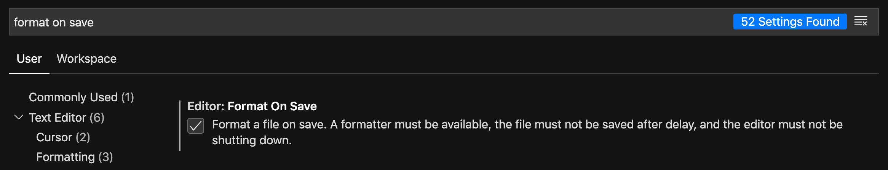
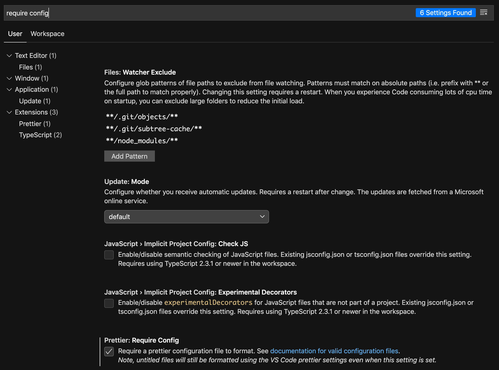

# prettier

## Add script to `package.json` file
```js
{
  "scripts": {
    "format": "prettier \"src/**/*.{js,html}\" --write",
  },
}
```

The `format` command in scripts specifies that prettier should run on all `js` and `html` files within the any folder within the `src` directory. The `--write` flag indicates that prettier should modify any documents that need formatting and save them. Prettier can be run via the CLI using `yarn format` or `npm run format`.


## Update settings in VS Code to automate prettier

### Run prettier on save


### Require prettier configuration file so it only formats projects that have a `.prettierrc` file
